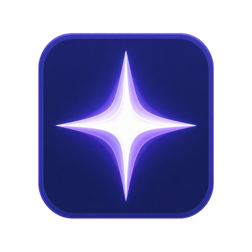
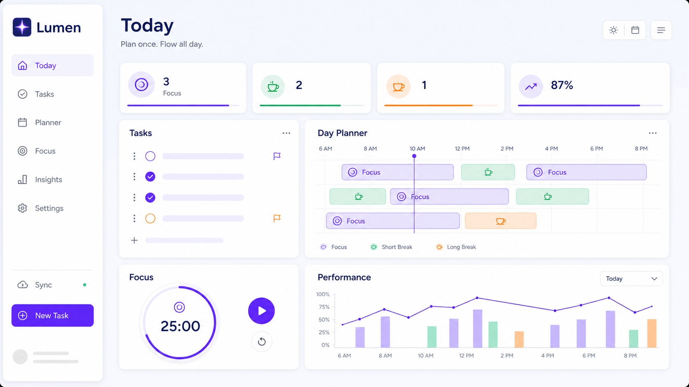
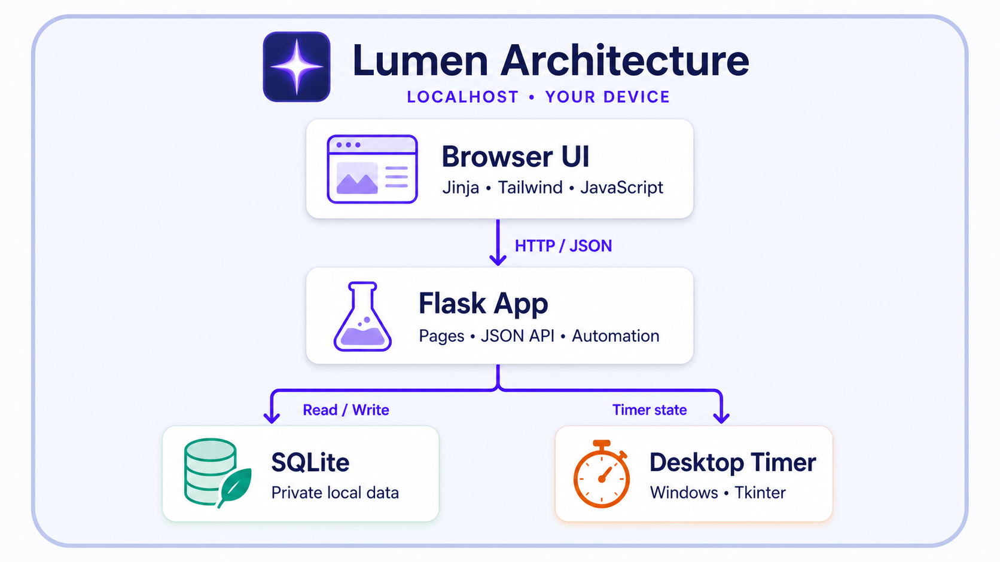

<div align="center">
  

  # Lumen

  **A calm, local-first personal operating system for planning focused days, running deep-work sessions, and understanding where your time goes.**

  [](https://www.python.org/)
  [](https://flask.palletsprojects.com/)
  [](https://www.sqlite.org/)
  [](https://github.com/imSaDy/Personal-Dashboard/actions/workflows/ci.yml)
  [](https://developer.mozilla.org/docs/Web/JavaScript)
  [](#native-desktop-timer)
</div>

---

## Product preview

<div align="center">
  
</div>

## What is Lumen?

Lumen brings daily planning, focus execution, task management, habits, goals, journaling, and performance reflection into one coherent workspace. It is intentionally local: your data lives in a SQLite database on your machine, the dashboard runs on localhost, and no cloud account is required.

The product is built around a simple loop:

1. **Choose what matters today.**
2. **Plan focus and recovery as a realistic timeline.**
3. **Let Lumen run the timers automatically.**
4. **Review the work with useful, readable reports.**

## Highlights

| Area | What it does |
| --- | --- |
| **Today** | A focused home screen for next actions, routines, the goal of the day, and short journal check-ins. |
| **Day Planner** | Builds a graphical focus/break timeline with precise time controls, quick generation, editing, overlap protection, and automatic timer transitions. |
| **Focus Timer** | Runs Focus, Short Break, Long Break, and custom sessions with persistent timestamp-based state. |
| **Native desktop timer** | Shows the active manual or planned timer in a small Windows always-on-top window outside the browser. |
| **Performance** | Visualizes time allocation, activity mix, momentum, primary-focus share, and daily through yearly trends. |
| **Activity autocomplete** | Reuses canonical activity names so reporting stays clean and consistent. |
| **Tasks** | Manages prioritized work with deadlines, status, editing, and safe deletion flows. |
| **Habits & streaks** | Tracks routines and presents a seven-day consistency score with progressive visual states. |
| **Goals** | Connects longer-term outcomes to the current day and tracks progress over time. |
| **Quick capture** | Adds a task from anywhere in the dashboard without breaking context. |

## Native desktop timer

The Windows launcher starts a lightweight Tk-based companion alongside Flask. It watches the same local schedule and supports both planned and manual timer states.

- Always on top and independent of the browser window
- Opens automatically when an enabled Day Planner block starts
- Can be shown or hidden from either Timer or Planner
- Reopens the same active session after the native window is closed
- Displays mode, countdown, remaining progress, and the next block
- Uses the Lumen icon and theme-aware Focus/Break colors
- Cleans itself up when the dashboard server exits

The dashboard remains usable on other operating systems; the native always-on-top companion is currently Windows-specific.

## Performance and reporting

Lumen's reporting layer is designed for reflection rather than vanity metrics:

- Daily, weekly, monthly, and yearly ranges
- Period-over-period momentum
- Activity totals with canonical naming
- Focus-share and time-allocation summaries
- Responsive Chart.js visualizations
- Stable chart containers that prevent runaway resizing
- A theme-compatible color system that keeps adjacent activity segments distinct

## Architecture

<div align="center">
  
</div>

### Technology

- **Backend:** Python, Flask, SQLite
- **Frontend:** Jinja templates, Vanilla JavaScript, Tailwind CSS
- **Charts:** Chart.js
- **Desktop integration:** PowerShell, VBScript, Tkinter

## Quick start

### Windows: one-click setup (recommended)

No Python, Flask, or Git installation is required.

1. Download this repository with **Code → Download ZIP** and extract it, or clone it with Git.
2. Double-click **`Setup-Lumen.cmd`**.
3. Wait for the setup check to finish; Lumen opens and a desktop shortcut is created.

The setup uses an existing Python 3.10+ installation when available. Otherwise, on supported Windows 10/11 systems, it installs Python through the official Python Install Manager, creates an isolated `.venv`, installs the pinned dependency range, verifies a temporary empty database, and installs the Lumen shortcut. Internet access is needed only for the initial dependency installation.

If Windows Package Manager is missing, install Microsoft's [App Installer](https://aka.ms/getwinget), then run `Setup-Lumen.cmd` again.

### Manual setup

```powershell
git clone https://github.com/imSaDy/Personal-Dashboard.git
cd Personal-Dashboard
python -m venv .venv
.\.venv\Scripts\python.exe -m pip install -r requirements.txt
.\.venv\Scripts\python.exe app.py
```

Open [http://127.0.0.1:5000](http://127.0.0.1:5000).

The SQLite schema initializes automatically on first run. A new checkout starts with a valid, completely empty database—no example records and no maintainer data.

## Windows desktop shortcut

The one-click setup installs this automatically. To recreate only the shortcut, run:

```powershell
powershell -ExecutionPolicy Bypass -File .\launcher\Install-DesktopShortcut.ps1
```

This installs **Personal Dashboard** on the current user's desktop with the Lumen icon.

## Development

### Rebuild the CSS bundle

The compiled CSS is committed, so Node.js and Tailwind are not required to run Lumen. For UI development, download the [Tailwind CSS standalone CLI](https://github.com/tailwindlabs/tailwindcss/releases/latest) for your platform, place it in the project root as `tailwindcss.exe`, then run:

```powershell
.\tailwindcss.exe -i .\static\style.css -o .\static\tailwind-built.css
```

The local executable is intentionally ignored because generated platform binaries do not belong in the source repository.

### Useful checks

```powershell
Get-ChildItem .\static\*.js | ForEach-Object { node --check $_.FullName }
.\.venv\Scripts\python.exe -m compileall app.py database.py launcher scripts
.\.venv\Scripts\python.exe .\scripts\verify_fresh_install.py
.\.venv\Scripts\python.exe .\scripts\verify_release.py
```

The GitHub Actions workflow runs these checks on every push and pull request.

### Health endpoint

```text
GET /api/health
```

The response includes the application identity, startup time, and a deterministic source revision used by the Windows launcher.

## Local data and privacy

- User data is stored only in the local `database.db` beside the application.
- The public repository contains no database file or starter records; every clone creates its own blank database.
- Database files, SQLite sidecars, backups, exports, local environments, logs, and generated archives are ignored by Git.
- The application does not require an account.
- No analytics or cloud synchronization are built in.
- The desktop companion talks only to the local Flask server.
- Back up `database.db` separately before moving or reinstalling the application.

## Project structure

```text
Personal-Dashboard/
├── .github/workflows/ci.yml       # Automated release checks
├── Setup-Lumen.cmd                # Double-click Windows setup entry
├── Setup-Lumen.ps1                # Python/dependency/shortcut setup
├── requirements.txt               # Python dependency range
├── app.py                         # Flask pages, APIs, and runtime coordination
├── database.py                    # SQLite access and domain queries
├── schema.sql                     # Database schema
├── scripts/
│   ├── verify_fresh_install.py    # Empty-database integrity check
│   └── verify_release.py          # Pages, health, and privacy smoke test
├── launcher/
│   ├── dashboard_server.py        # Stable production-style local server entry
│   ├── desktop_floating_timer.py  # Native Windows always-on-top timer
│   ├── Start-PersonalDashboard.ps1
│   ├── Open Personal Dashboard.vbs
│   ├── Install-DesktopShortcut.ps1
│   └── Lumen.ico
├── media/
│   ├── lumen-dashboard-preview.png
│   └── lumen-architecture.png
├── static/
│   ├── planner.js                 # Day Planner behavior and automation UI
│   ├── timer.js                   # Persistent manual/scheduled timer state
│   ├── schedule-runner.js         # Cross-page schedule synchronization
│   ├── charts.js                  # Performance visualizations
│   ├── activity-autocomplete.js
│   ├── tailwind-built.css
│   └── lumen-icon.png
└── templates/
    ├── base.html
    ├── today.html
    ├── planner.html
    ├── timer.html
    ├── performance.html
    ├── tasks.html
    ├── habits.html
    └── goals.html
```

## Design principles

- **Calm by default:** information density without visual noise
- **Fast capture:** common actions stay one or two interactions away
- **Consistent language:** canonical activity names and shared controls
- **Automation with control:** planned sessions start automatically but remain reversible
- **Local ownership:** the user keeps the data and the application remains useful offline

---

<div align="center">
  <strong>Lumen</strong><br>
  Plan with intention. Focus without friction. Learn from the day.
</div>
